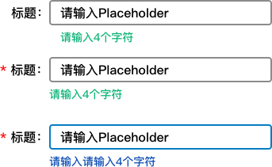

# 表单

> 通常产品（尤其是后台产品）常常被开发抱怨，有很多东西没有定义清楚 —— 仿佛解数学题的时候，“显然可证”；但是，对于产品来说，这些未定义的东西，要么“理应如此”，要么“已经被重复的定义”，当然，也有因为遗漏，而现编的内容；

那么我们要如何来避免发生这种情况呢？我的做法是，在定义功能之前，先定义组件，比如说一个功能需要运营提交一份表单，那么这个表单会涉及哪些通用的组件，每个组件有哪些必不可少的属性，就像一个螺丝有配套的螺帽、垫片、胶圈；如果都定义清楚了，就不太会有非功能性的“找不到定义”
 
该文档列举了常见的表单工具，并且定义了什么时候该使用这个组件；

## 通用属性
表单的通用属性往往依赖于框架；所以建议和开发沟通后定义；
以下列出了Angular的表单做法
1. 时态
    1. 初始状态，页面加载时的状态；
    2. focus状态，聚焦状态；
    3. 失焦：这是一个可以检测的动作，通常可以触发校验；
    4. 被污染的：用户填写了内容，然后又清空了内容，此时，他被编辑过；
2. 填写提示
  填写提示一般使用placeholder或者单独的小字提示，可以在focus状态显示也可以是

## 文本框（Input box）

一个文本框应该包括以下属性：
1. 标题（title） | 定义该文本框的字段，建议和后台字段保持相对应
2. 值域 | 可以填写的内容范围，包括字数、是否支持特殊符号、支持哪些符号
3. Placeholder | 通常是填写说明或者是举例子，灰色，键入内容时隐藏

  
* 如果留空是否自动显示是可定义的，比如Angular中，一个填写后删除的文本框，可以不显示；